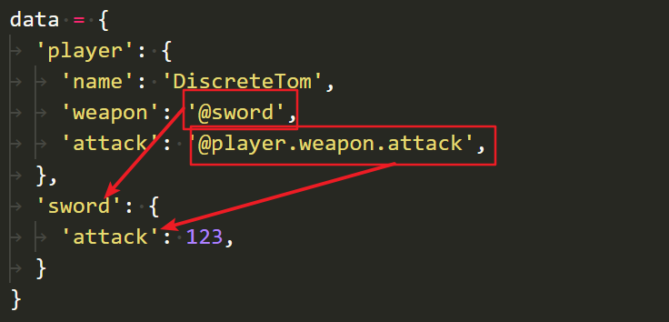

# refdict

在Python使用refdict更好地组织与访问数据



兼容dict/list/tuple/str！

- [refdict](#refdict)
	- [Install](#install)
	- [Usage](#usage)
	- [Features](#features)
	- [Warnings](#warnings)
	- [FAQ](#faq)
	- [Change Log](#change-log)
		- [v2.1.0](#v210)
		- [v2.0.0](#v200)
		- [v1.0.0](#v100)

## Install

`pip install refdict`

## Usage

在字符串值前面加上**引用前缀**使其变成**另一个对象的引用**。默认的引用前缀是`@`。可以在构造函数中传入参数`refPrefix`来改变引用前缀

在`[]`运算符中使用一个字符串实现refdict内容的链式访问。使用`.`作为多个key的连接符。可以在构造函数传入参数`separator`来改变分隔符

```python
data = {
	'player': {
		'name': 'DiscreteTom',
		'items': [
			'@apple',
			'@potion.red'
		],
		'weapon': '@sword',
		'attack': '@player.weapon.attack',
		'me': '@player'
	},
	'apple': 'restore your health by 10%',
	'potion': {
		'red': 'restore your health by 20%',
	},
	'sword': {
		'attack': 123,
		'value': 50
	},
}
rd = refdict(data)
print(rd['player.items.1']) # => restore your health by 20%
print(rd['player.attack']) # => 123
rd['player.items.1'] = 'empty'
print(rd['player.items.1']) # => empty
print(rd['player.items.:.1']) # => empty
rd['player.items.:'] = []
print(rd['player.items']) # => []
print(rd.text('player.me.attack')) # => @player.weapon.attack
```

## Features

- 能够像使用`dict`/`list`/`tuple`/`str`一样使用`refdict`
  - 能够调用对应类型的函数，如`refdict({}).keys()`或`refdict([]).append(123)`
  - 迭代与成员判断`for x in refdict([1, 2, 3])`
  - 切片与切片赋值`refdict([1, 2, 3])[:] => [1, 2, 3]`
  - ...
- 能够通过一个字符串链式访问内部成员
  - `refdict({'1':{'1':{'1':{'1':'1'}}}})['1.1.1.1'] => 1`
- 能够通过引用字符串实现对象与对象之间的互相引用

## Warnings

使用形如`item: @item`的**递归引用**会导致**死循环**，包括间接递归引用

```python
data = {
	'item': '@item', # => infinite loop!
	'wrapper': {
		'item': '@wrapper.item' # => infinite loop!
	},
	'a': '@b' # => infinite loop!
	'b': '@a' # => infinite loop!
}
```

## FAQ

- Q - 为什么我用1作为下标访问不到list/tuple/str的第一个元素？
  - A - 和python一样，下标从0开始计数。虽然用起来有时候感觉有些反直觉，但是是合理的
- Q - 为什么我不能像`refdict[1][2][3]`这样使用引用的特性？
  - A - 引用解析仅限于第一个`[]`，第一个`[]`会返回一个正常的`tuple`/`list`/`dict`/`str`而不是一个`refdict`对象，所以后面的操作无法使用引用特性

## Change Log

### v2.1.0

- 可以调用根数据类型的非内置函数
  - 比如`refdict({})`可以使用`dict`的`keys`函数，`refdict([])`可以使用`list`的`append`函数
- `[]`运算的参数`keys`添加`int`类型和`slice`类型的支持，以便更好地访问`list/tuple/str`。目前参数`keys`仅支持`str`、`int`和`slice`三种类型
- 实现`__contains__`
- 实现`__str__`以便输出
- 实现`__delitem__`以使用引用解析来删除元素

### v2.0.0

改名。还是小写看起来舒服。但是不向前兼容了所以就用2.0.0的版本号好了

### v1.0.0

- 实现基本的`[]`取值与赋值
- 实现`text`函数以获得字面值